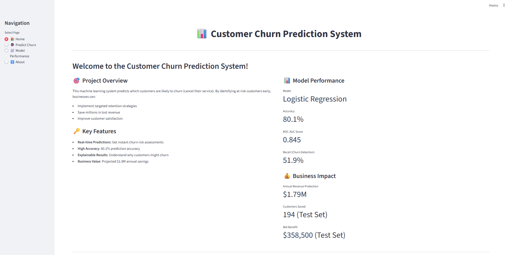
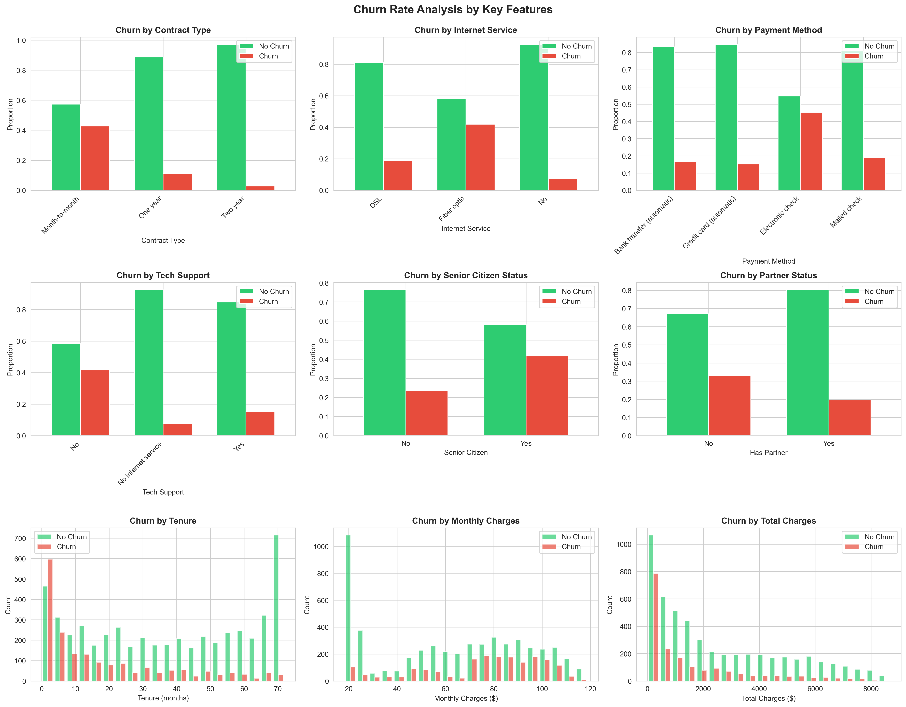
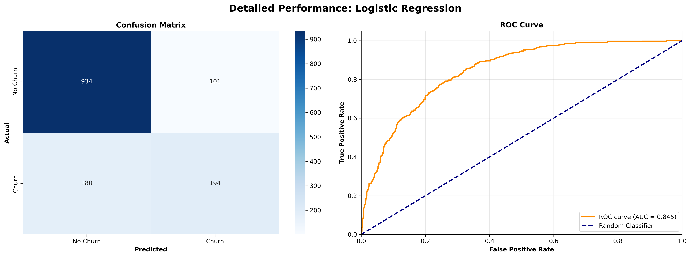
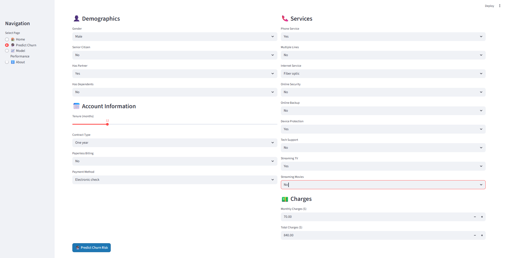
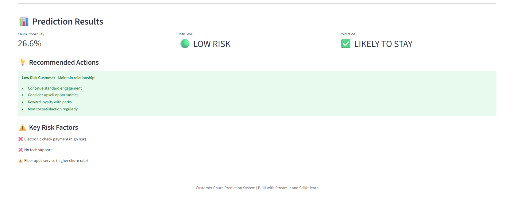
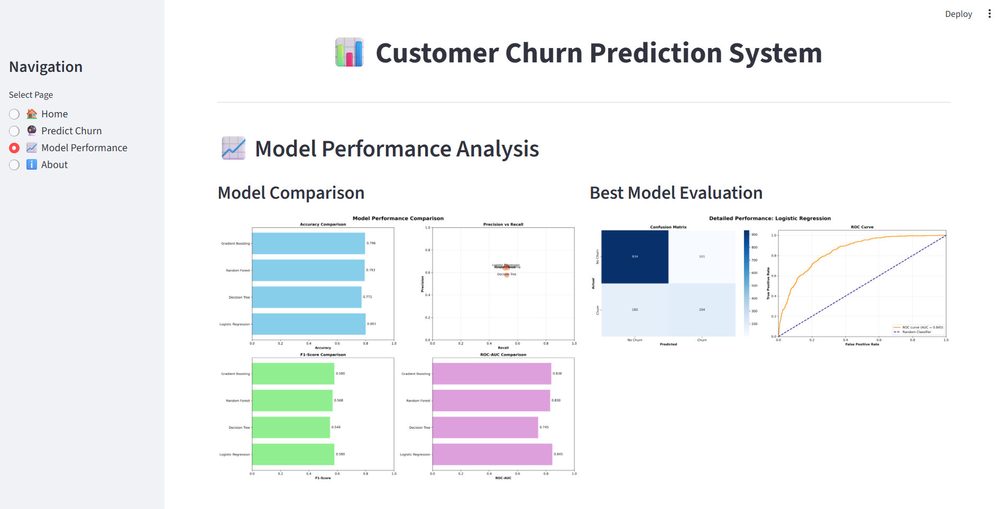

# Telecom Customer Churn Prediction System

## Executive Summary

- Built ML system to identify at-risk telecom customers, enabling proactive retention before cancellation
- Trained 4 models on 7,043 records with 26.5% churn rate; **Logistic Regression achieved 84.5% ROC-AUC**
- Deployed interactive Streamlit dashboard for real-time predictions with automated feature engineering
- **$1.79M projected annual savings** with 652% ROI on retention investments

## Business Problem

Customer acquisition costs exceed retention costs by 5-7x in telecom. This system transforms reactive churn processing into proactive retention by identifying high-risk customers for targeted intervention, optimizing retention budgets, and protecting customer lifetime value in a competitive market with 15-25% annual churn rates.

## Data & Approach

**Dataset**: 7,043 telecom customers ([Kaggle source](https://www.kaggle.com/datasets/blastchar/telco-customer-churn))  
**Features**: Demographics, services (phone/internet/streaming/support), account details (tenure, contract, payment), billing  
**Target**: Binary churn (26.5% imbalanced)

**Pipeline**: EDA → Feature Engineering (7 new features) → Preprocessing → Model Training (4 algorithms, 5-fold CV) → Streamlit Deployment

## Key Insights

**High-Risk Segments**:
- Month-to-month contracts: **42% churn** vs 14% annual (3x risk)
- Electronic check payment: **45% churn** (highest across payment methods)
- No tech support: **42% churn** (support is strong retention lever)
- First 6 months: Peak vulnerability window
- Fiber optic customers: Elevated churn (potential service quality issue)

**Implication**: Prioritize month-to-month customers in early tenure without tech support.

## Feature Engineering

Created 7 strategic features capturing customer value and behavior:

- **CLV**: `MonthlyCharges × Tenure` (revenue at risk)
- **Tenure Groups**: 5 buckets capturing non-linear loyalty patterns
- **Charges Ratio**: Detects pricing changes/promo endings
- **Service Count**: Engagement intensity (0-9 services)
- **Tech Support Flag**: Isolates strongest predictor
- **Security Services**: Aggregates correlated security features
- **Charges Category**: Price sensitivity segments (Low/Med/High)

Expanded from 21 → 41 features through one-hot encoding and strategic derivation.

## Model Performance

| Model | Accuracy | Precision | Recall | ROC-AUC |
|-------|----------|-----------|--------|---------|
| **Logistic Regression** ✓ | **80.1%** | **65.8%** | **51.9%** | **84.5%** |
| Gradient Boosting | 79.6% | 64.1% | 52.9% | 83.8% |
| Random Forest | 79.3% | 63.9% | 51.1% | 83.0% |
| Decision Tree | 77.1% | 57.6% | 52.4% | 74.5% |

**Selection Rationale**: Logistic Regression chosen for best ROC-AUC, interpretability, and computational efficiency. Feature engineering > algorithm complexity for this problem.

**Confusion Matrix** (Test Set): TN=934, FP=101, FN=180, TP=194  
Balance between catching churners (recall) and minimizing false alarms (precision) optimized for business economics.

## Business Impact

**Test Set (1,409 customers)**:
- Correctly identified: **194 of 374 churners**
- Revenue protected: $368,600 (194 × $1,900 net value)
- Wasted on false alarms: $10,100 (101 × $100)
- **Net benefit: $358,500**

**Annual Projection (7,043 customers)**: **$1.79M savings** | **ROI: 652%**

*Assumes $2,000 customer LTV, $100 retention cost. Break-even at 5% recall—model is 10x above threshold.*

## Deployment

**Streamlit Application** with 4 pages:

### Real-Time Prediction Interface

*Customer data input form with comprehensive service and billing options*

*Instant churn probability with risk stratification and personalized recommendations*

### Model Performance Dashboard

*Comprehensive model evaluation with confusion matrix, ROC curves, and comparison charts*

**Production Features**: 
- Automated feature engineering pipeline
- Consistent preprocessing with training
- Risk stratification (High/Medium/Low)
- Personalized retention recommendations
- Key risk factor identification

**Run**: `streamlit run streamlit_app.py`

## Tech Stack

**ML**: Scikit-learn, Joblib | **Data**: pandas, NumPy | **Viz**: Matplotlib, Seaborn, Plotly | **Deploy**: Streamlit  
**Tools**: Python 3.8+, Jupyter, Git

## Key Takeaways

- **Business-first ML**: Model selection driven by ROI, not just accuracy
- **Feature engineering matters**: Strategic features outperformed complex ensembles
- **Production-ready**: End-to-end pipeline from EDA to deployed application
- **Quantified impact**: $1.79M value with clear ROI justification

**Counterintuitive**: Simpler model beat ensembles—data understanding > algorithm complexity.

## Future Work

- SMOTE/cost-sensitive learning for better recall
- Survival analysis for time-to-churn predictions
- MLOps: automated retraining, drift detection, A/B testing
- Cloud deployment (AWS/GCP) with API serving
- Causal inference for prescriptive retention offers

---

**Nikhil Vanama** | vanamanikhil0@gmail.com | [GitHub](https://github.com/NikhilGG123)